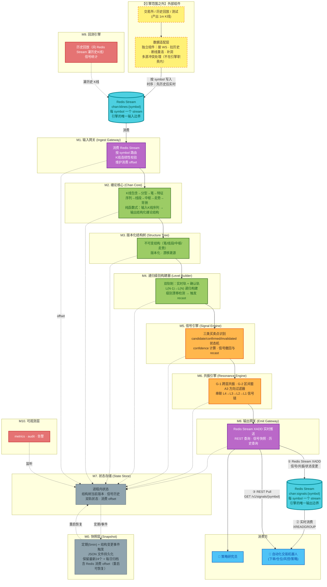

# 信号分析系统 PRD（Signal Analysis System）

> 版本：v1.8
> 日期：2026-06-22
> 状态：**需求评审通过 + 四轮全文审查完成** ✅（R1~R31 全部锁定）
> 相关文档：[缠论算法.md](./缠论算法.md) 及其引用的 14 份算法规范（12 份核心算法 + 附录A/B，计数说明见 §7）

---

## 0. 文档约定

- 本 PRD 描述**终态系统**（不做分阶段裁剪），但在 §20 给出**工程构建顺序**作为落地参考。
- 所有"缠论术语"严格沿用本仓库 14 份算法文档的定义，本文不重新发明术语。
- 所有 JSON 交互字段名统一使用**小驼峰**（camelCase）；symbol 值统一使用大写交易对（如 `BTCUSDT`）。
- 标注 `⚠️ 待评审` 的条目为产品经理设定的默认值，可在评审时推翻。（当前版本无异类条目）
- **评审状态**：§19 的全部决策（R1~R31，覆盖 6 个维度 + 动态 symbol 管理）已全部锁定（✅），全文无待评审项。后续变更走变更评审流程。
- 本系统**不含**下单执行、仓位管理、风控策略——这些属于消费方"自动化交易机器人"的职责。本系统的边界是：**输入 K 线流，输出结构化买卖点信号
  **。

---

## 1. 产品定位

### 1.1 一句话定义

一个**给自动化交易机器人消费的缠论信号引擎**：消费外部数据适配层写入的 K 线流，实时计算真递归多级别缠论结构，对外提供买卖点信号的
REST 查询。

### 1.2 谁不是本系统

| 不是      | 为什么                                                     |
|---------|---------------------------------------------------------|
| 交易执行系统  | 不下单、不管仓位、不做风控                                           |
| 可视化看盘工具 | `index.html` 已被明确为"仅算法验证参考"，与本系统无关                      |
| 预测系统    | 缠论是**结构确认**系统，不是价格预测系统（见 §3.2）                          |
| 行情接入系统  | **不接交易所**。K 线获取由外部"数据适配层"负责（见 §4/§5），引擎只消费 Redis Stream |

### 1.3 核心价值主张

**忠实地把缠论在说什么，结构化地报告给机器人；不替机器人做决策，但提供足够的信息让机器人自己决策。**

---

## 2. 干系人与使用场景

| 角色                | 场景              | 关注点              |
|-------------------|-----------------|------------------|
| **主消费者：自动化交易机器人** | 实时订阅信号 → 自主决定下单 | 延迟、确定性、可审计、可回放   |
| **次消费者：策略研究员**    | 回测历史信号、调参、验证算法  | 信号统计、结构可复现、版本可追溯 |
| **运维**            | 监控引擎健康、漂移率、假信号率 | 可观测性、告警          |

---

## 3. 核心设计原则

### 3.1 引擎是"报告者"，不是"决策者"

引擎**只如实报告缠论结构状态**：现在是 candidate 还是 confirmed、confidence 多少、有没有被 recast。下不下单、用激进还是保守策略，完全由机器人决定。

> 落地体现：candidate 和 confirmed **两种状态都推送**（用户决策已锁定）。机器人自选消费哪种。

### 3.2 缠论是"结构确认"，不是"价格预测"

缠论告诉机器人"结构走到这里，发生转折的概率高"，但这个确认**本身需要时间**——这是缠论的认识论前提（走势终完美 =
事后才能完美）。本系统不试图消灭这个滞后，而是：

- 把滞后**分层**（L4 方向 / L3 战术 / L2 候选 / L1 入场）
- 用**区间套**把多层级的滞后串联成一条"由远及近"的信号链
- 把滞后**透明化**：每个信号带 `recastRisk` 和 `provisional` 标记

### 3.3 理论纯粹性 vs 工程可用性的妥协记录

所有偏离缠论原文的工程妥协，必须在本文档显式记录（见 §3.4），不得默默引入。

### 3.4 已知妥协清单

| 妥协              | 理论要求                    | 工程实现                             | 代价                                                      |
|-----------------|-------------------------|----------------------------------|---------------------------------------------------------|
| **A股→加密货币语境迁移** | 缠论原生于A股（固定交易时段、T+1、涨跌停） | 应用于 24×7 连续交易的加密货币市场             | 级别的时间跨度统计基于实际时序而非交易日历；`levelTimeHint` 动态统计（§6.3）部分缓解此差异 |
| L0 数据源（§6.1 定义） | 从 tick 开始最纯粹            | 用 1m K线                          | 1m 内的微观结构丢失，对 L1 信号精度有轻微影响                              |
| 走势结束判定          | 原文有不同说法                 | "背驰或被反向破坏，先发生者"                  | 引入"反向破坏"的判定本身有滞后                                        |
| 级别时间化           | 级别是结构属性，非时间             | 暴露 `levelTimeHint` 给机器人          | 仅为消费方便，不改变级别定义                                          |
| 引擎不接交易所         | 理论上数据源是分析的一部分           | 引擎只消费 Redis Stream，K 线获取外包给数据适配层 | 引擎无法感知数据源故障，需通过 K 线时序缺口间接判断（已在 M1 设计）                   |

---

## 4. 系统总体架构

> **核心定位（维度 1 已锁定）**：信号引擎是**黑盒计算引擎**，只认 K 线，不接交易所。K 线由外部数据适配层产出，经 Redis Stream
> 输入。引擎从第一根 K 线起即正常工作，**无 warming_up 概念**，结构随 K 线流入逐步生长。



**架构要点**：

1. 引擎的**唯一输入**是 Redis Stream，**唯一真值**是 stream 里的 K 线
2. 引擎的**唯一输出**也是 Redis Stream（`chan:signals:{symbol}`），输入输出对称设计——REST 为辅助查询，不作为实时推送通道
3. 引擎与数据源**完全解耦**——数据适配层是独立组件，可替换（实盘/回测/测试用不同适配器）
4. 引擎**无 warming_up 状态**——从第一根 K 线起即正常产出信号，confidence 自然反映结构完整度
5. 回测 = 把历史 K 线灌进同一个 Redis Stream，与生产**完全相同的代码路径**

---

## 5. 模块拆分与职责边界

> **引擎范围**：M0~M10。**引擎范围之外**：数据适配层（独立组件，负责接交易所、拉历史、补洞）。

| 模块            | 职责                                                   | 关键接口                                                      | 不做什么                         |
|---------------|------------------------------------------------------|-----------------------------------------------------------|------------------------------|
| **【外部】数据适配层** | 接交易所 WS、产出 1m K线、断线重连、补洞、多源冲突处理                      | 写 Redis Stream                                            | **不在引擎范围**，可替换为回测/测试适配器      |
| **M1 输入网关**   | 消费 Redis Stream、按 symbol 路由、K 线连续性校验、维护消费 offset     | `OnKLine(symbol, kline)` 内部分发                             | 不做任何缠论计算、不接交易所               |
| **M2 缠论核心**   | 14 份算法的纯函数实现，单级别内从 K线到走势类型的全链路结构计算                   | `Analyze(klines) → ChanStructure`                         | 不维护状态、不做级别递归、不识别买卖点（买卖点归 M5） |
| **M3 结构树**    | 存储缠论结构为不可变版本化树，提供任意历史时刻的结构快照                         | `Commit(structure) → VersionId`、`Query(versionId, level)` | 不做信号识别                       |
| **M4 递归级别构建** | 双轨制构建多级别，检测级别漂移，触发 recast                            | `BuildLevels(structure) → MultiLevelTree`                 | 不识别买卖点                       |
| **M5 信号引擎**   | 三类买卖点识别、状态机流转、confidence 计算、信号生命周期管理                 | `OnStructureChange(delta) → SignalEvents`                 | 不做共振判定                       |
| **M6 共振引擎**   | G-1 跨层、G-2 区间套、A3 方向过滤、共振等待窗口管理                      | `OnSignalEvents() → ResonanceEvents`                      | 不识别单个买卖点                     |
| **M7 状态存储**   | 进程内状态：结构树当前版本、信号历史、双轨状态、消费 offset                    | 内存数据结构 + 访问接口                                             | 不含业务逻辑、不做持久化（持久化归 M0）        |
| **M0 快照层**    | 定期(5min) + 结构变更事件触发，序列化进程状态为 JSON                    | `Snapshot() → file`、`Restore(file) → state`               | 不做实时同步、不做跨实例共享               |
| **M8 输出网关**   | 主通道：Redis Stream XADD（信号/共振/状态变更实时推送）；辅助查询：REST 快照查询 | `XADD chan:signals:{symbol}` + `GET` HTTP 接口              | 不做计算                         |
| **M9 回测引擎**   | 向 Redis Stream 灌历史 K 线、复现信号、统计胜率/盈亏比                 | `Backtest(range, config) → Report`                        | 不优化策略、不另写算法路径                |
| **M10 可观测**   | metrics、audit log、漂移监控、假信号率告警                        | metrics endpoint、告警通道                                     | 不做交易                         |

**模块依赖关键约束**：

- M2 必须**纯函数**：相同 K 线序列必产出相同结构（可重放、可回测、可快照恢复的前提）
- M1 是引擎的**唯一入口**，M8 是**唯一出口**
- M0 的快照必须包含 M7 的全部状态 + Redis 消费 offset，否则重启会漏数据或重复消费
- **关于编号**：M0 编号为 0 是因为它属于**基础设施层**（持久化/恢复），不参与主链路的 K 线流转，逻辑上排在主链路（M1→M2→...→M8）之外

---

## 6. 级别体系（真递归 + 4 层职责分层）

### 6.1 递归定义（严格）

```
L0 = 1分钟K线（数据源层，不参与递归，仅作为数据源标记）
L1 = L0 的合并K线 → 分型 → 笔 → 线段 → 中枢 → 走势类型
LN = L(N-1) 的走势类型 作为"笔" → LN线段 → LN中枢 → LN走势类型  (N≥2)
```

**核心钉死**：`L(N-1)` 的**一个完整走势类型**（盘整=1中枢+结束 / 趋势=≥2个同向不重叠中枢+结束）= `LN` 的**一根笔**。

**走势结束判定**（R1 已锁定）：`背驰出现` 或 `被反向走势破坏`，**二者先发生者**。

**"反向破坏"的精确定义**：次级别出现一个完整的反向走势类型 = 次级别形成**至少 1 个反向中枢并被有效突破**。

> 设计取舍：
> - 选定方案覆盖 V 型反转（无背驰反转）和背驰反转两种场景，平衡时效性。
> - 已知代价：引入"反向破坏"判定本身有滞后（要等次级别中枢形成），但优于"只看背驰"（漏 V 型）和"只看反向破坏"（滞后过大）。
> - 备选方案 (d) 用次级别三卖/三买确认最精确但太慢，不符合"实时交易"诉求，已否决。

### 6.2 4 层职责分层（基于延迟分析锁定）

| 级别     | 职责   | 典型确认延迟 | 触发频率   | 机器人用法        |
|--------|------|--------|--------|--------------|
| **L4** | 战略方向 | 数天~数周  | 极低频    | 设定"允许做多的总方向" |
| **L3** | 战术准备 | 1天~数天  | 每天/每半天 | 进入"埋伏状态"     |
| **L2** | 入场候选 | 半天~1天  | 每小时数次  | **区间套触发器**   |
| **L1** | 精确入场 | 5~20分钟 | 每几分钟   | **下单触发**     |

### 6.3 级别时间化接口（给机器人用的）

每个级别动态统计并暴露时间跨度参考（**仅供机器人风控参考，不改变级别定义**）：

```yaml
level: L3
timeHint:
  avgDurationSec: 14400       # 历史平均 ≈4小时
  p10DurationSec: 3600        # 10分位 ≈1小时
  p90DurationSec: 43200       # 90分位 ≈12小时
  sampleCount: 87              # 统计样本数（样本不足时 timeHint 不可信）
structureDepth:
  avgL2ZoushiPerL3Bi: 3.2  # 平均由3.2个L2走势构成
```

---

## 7. 缠论核心算法映射（12 份核心算法 + 2 份附录算法 → 工程模块）

M2 的实现严格对照本仓库算法文档（12 份核心算法 + 附录A/B 共 14 份算法规范），**不引入文档外的逻辑**：

| 算法文档       | M2 内模块           | 输入 → 输出                 | 备注           |
|------------|------------------|-------------------------|--------------|
| K线包含处理算法   | `inclusion`      | 原始K线[] → 合并K线[]         |              |
| 分型识别算法     | `fractal`        | 合并K线[] → 分型[]           |              |
| 笔.md       | `bi`             | 分型[] → 笔[]              |              |
| 特征序列算法     | `feature_seq`    | 笔[] → 特征序列[]            |              |
| 线段划分算法     | `segment`        | 笔[]+特征序列 → 线段[]         |              |
| 中枢识别算法     | `zhongshu`       | 线段[]/笔[] → 中枢[]         |              |
| 走势类型分类算法   | `zoushi`         | 中枢[] → 走势类型[]           |              |
| 背驰判定算法     | `divergence`     | 价格极值[]+MACD柱[] → 背驰信号[] |              |
| 级别递归算法     | （M4 负责，不在 M2）    | —                       |              |
| 买卖点识别算法    | （M5 负责，不在 M2）    | —                       |              |
| 分型操作策略算法   | （M5 参考，非 M2 纯函数） | —                       | 辅助策略，非核心结构计算 |
| 第三类买卖点操作算法 | （M5 参考，非 M2 纯函数） | —                       | 辅助策略，非核心结构计算 |
| 附录A-均线系统算法 | （M5/M6 可参考）      | —                       | 辅助指标，非必选     |
| 附录B-板块强弱指标 | （M5/M6 可参考）      | —                       | 辅助指标，非必选     |

> 计数说明：12 份核心算法 + 附录A（均线系统算法）+ 附录B（板块强弱指标）= 14 份算法规范。附录C（算法确定性与局限性说明）为元文档，不计入算法规范。

**M2 的契约**：纯函数，无副作用，可重入。给定相同 K线输入，必须产出**完全相同**的缠论结构（可重放、可回测的前提）。

**M2 的增量约束**（R16 已锁定）：

- 所有算法模块必须以**增量方式**实现（状态机式，每次处理一根新 K 线），不允许全量重算
- 14 份伪代码中 K线到笔的计算链天然增量（如 `笔.md` §3 "逐步推进状态机"）；线段及以上层在场景 B 下需回溯修正（详见 §10.4.1
  增量分析）
- **回溯修正子流程是 M2 必须补充的工程层**（伪代码未完整覆盖，详见 §10.4.3）——每个算法模块都要实现"检测历史元素被推翻 →
  定位受影响范围 → 撤销 → 重算"的通用流程

---

## 8. 信号数据契约

### 8.1 信号对象完整定义

```json
{
  "signalId": "sig_01HXYZ...",
  "symbol": "BTCUSDT",
  "ts": 1718000000000,
  "type": "BUY_1",
  "level": "L1",
  "levelTimeHint": { "avgDurationSec": 240, "sampleCount": 320 },

  "price": 66377.2,
  "state": "candidate",
  "provisional": true,
  "confidence": 0.72,
  "strength": 0.58,
  "recastRisk": 0.18,

  "anchor": {
    "kind": "divergenceSegment",
    "divergenceLineage": "L_div_01H...",
    "currentBiLineage": "L_bi_P5",
    "previousBiLineage": "L_bi_P3"
  },

  "targets": {
    "targetPrice": 68000.0,
    "targetSource": "lastZhongshuZG",
    "invalidationPrice": 65500.0,
    "invalidationSource": "belowPreviousLow"
  },

  "resonance": {
    "kind": "intervalNesting",
    "participants": [
      {"level":"L2","type":"BUY_2","signalId":"sig_01H..."},
      {"level":"L3","type":"DIRECTION_UP","signalId":"sig_01H..."}
    ],
    "directionFilter": {
      "alignedLevels": ["L3","L4"],
      "aligned": true,
      "boost": 0.15
    }
  },

  "structureVersion": "sv_01HXYZ...",
  "evidence": {
    "trendDirection": "down",
    "zhongshuCount": 2,
    "lastZhongshuId": "zs_01H...",
    "lastZhongshuBelow": true,
    "divergence": {
      "method": "macdArea",
      "currentArea": 1234.5,
      "previousArea": 1678.9,
      "ratio": 0.736,
      "threshold": 0.95
    },
    "strengthFactors": {
      "divergenceRatioTrend": "converging",
      "consecutiveConfirmations": 5,
      "pullbackDepthRatio": 0.32,
      "sublevelSignalEvolving": true
    },
    "intervalNestingChain": [
      {"level":"L4","inDivergenceSegment":true},
      {"level":"L3","inDivergenceSegment":true},
      {"level":"L2","inDivergenceSegment":true}
    ]
  },

  "supersedes": ["sig_01H..."],
  "recastFrom": null
}
```

### 8.2 字段语义

| 字段               | 取值                                                          | 说明                             |
|------------------|-------------------------------------------------------------|--------------------------------|
| `type`           | `BUY_1/2/3`、`SELL_1/2/3`                                    | 三类买卖点                          |
| `state`          | `candidate / confirmed / invalidated / superseded`          | 状态机当前态                         |
| `provisional`    | bool                                                        | 是否来自实时轨（确认轨的信号为 false）         |
| `confidence`     | 0.0~1.0                                                     | 综合置信度——"值不值得信"（跨信号排序用），见 §8.4  |
| `strength`       | 0.0~1.0                                                     | 信号强度——"有多成熟"（时序演化累积度），见 §8.5   |
| `recastRisk`     | 0.0~1.0                                                     | 此信号因结构演化被改写的概率估算               |
| `anchor`         | object                                                      | 信号的结构锚点（身份判定用，见 §8.6）          |
| `targets`        | object                                                      | 目标位/失效位（机器人自判关闭时机用，见 §8.7）     |
| `resonance.kind` | `intervalNesting / crossLevel / standalone / directionOnly` | 共振类型                           |
| `evidence`       | object                                                      | 为什么发这个信号——中枢ID、背驰面积比、区间套链、强度因子 |
| `supersedes`     | signalId[]                                                  | 本信号取代的旧信号                      |
| `recastFrom`     | signalId or null                                            | 若本信号是 recast 产物，指向原信号          |

### 8.3 状态机流转（用户决策 C 已锁定）

| 信号     | candidate           | confirmed        | invalidated    |
|--------|---------------------|------------------|----------------|
| **一买** | 最后中枢下方 + MACD底背驰疑似  | 后续价格不创新低 + 反弹笔形成 | 价格继续创新低（背驰被打破） |
| **二买** | 一买后首次反弹，回调中（未破一买低点） | 回调笔完成 + 次级别企稳    | 回调跌破一买低点       |
| **三买** | 离开中枢后回调，高点低于ZG      | 回调中次级别底背驰出现      | 回调跌破ZG（回到中枢内）  |
| **一卖** | 最后中枢上方 + MACD顶背驰疑似  | 后续价格不创新高 + 回落笔形成 | 价格继续创新高（背驰被打破） |
| **二卖** | 一卖后首次回落，回抽中（未破一卖高点） | 回抽笔完成 + 次级别见顶    | 回抽涨破一卖高点       |
| **三卖** | 离开中枢后回升，低点高于ZD      | 回升中次级别顶背驰出现      | 回升涨破ZD（回到中枢内）  |

**流转事件**：状态变更时**重新发信号**（新 state + 关联旧 signalId）；`invalidated` 与 `superseded` **必须推送**，绝不静默丢弃。

> **关于"关闭"状态（R15 已锁定）**：状态机不加 `closed` 终态。confirmed 之后永远挂着，由机器人按 `ts` + `targets` 自判时效（见
> §8.7）。引擎不替机器人决定"信号何时过期"。

### 8.4 confidence 计算公式（跨信号排序用）

```
confidence = base(type)
           × divergenceStrength
           × directionAlignment
           × nestingDepth
           × (1 - recastRisk)
```

| 因子                   | 取值                                       | 来源                                                                                |
|----------------------|------------------------------------------|-----------------------------------------------------------------------------------|
| `base`               | BUY_1=0.60, BUY_2=0.70, BUY_3=0.75（卖点对称） | 缠论可操作点分类清单的可确定性评级                                                                 |
| `divergenceStrength` | `clamp(MACD面积比, 0, 1)`，比<0.5 视为 1.0      | 背驰判定算法.md。0.5 为工程设定（MACD 面积减半 = 背驰极强），与 0.95 背驰检测阈值分工：0.95 判定"是否背驰"，0.5 评定"背驰有多强" |
| `directionAlignment` | `1 + A3Boost`，A3 对齐时 boost ∈ [0, 0.2]    | 多级别方向共振                                                                           |
| `nestingDepth`       | `1 + 0.1 × 区间套层数`                        | G-2 区间套链长度                                                                        |
| `recastRisk`         | 基于历史漂移率统计的估算                             | 结构树版本化数据                                                                          |

> confidence 的绝对值无意义，**相对排序**才有意义：机器人用它做信号间的优先级比较。

### 8.5 strength 计算（信号成熟度，因子演化法，R14 已锁定）

**strength 与 confidence 的区别**：

| 维度   | confidence          | strength              |
|------|---------------------|-----------------------|
| 衡量什么 | 这个信号**值不值得信**（结构质量） | 这个信号**有多成熟**（时序演化累积度） |
| 来源   | 结构快照的**静态计算**       | 多次增量分析的**时序累积**       |
| 用途   | 跨信号排序               | 判断"该不该动手了"            |

**计算方法（因子演化法）**：strength 跟踪信号赖以成立的关键结构特征**是否在变强**，而非简单计数。核心因子：

| 因子                         | 含义                    | 演化方向                                                                       |
|----------------------------|-----------------------|----------------------------------------------------------------------------|
| `divergenceRatioTrend`     | MACD 面积比的收敛趋势         | `converging`（持续缩小）→ strength 升；`oscillating` → 持平；`diverging` → strength 降 |
| `consecutiveConfirmations` | 连续多少根 K 线维持信号判定       | 越多 → strength 越高（信号被反复确认）                                                  |
| `pullbackDepthRatio`       | 回调深度占预期区间的比例（三买/二买适用） | 浅回调 → strength 高（接近确认）                                                     |
| `sublevelSignalEvolving`   | 次级别信号是否在同步演化          | 是 → strength 升（共振向确认收敛）                                                    |

**因子到分数的映射规则**（B2 已锁定，初始默认值，可通过 §13.4 标定调整）：

| 因子                         | 原始值                                        | 映射到 0.0~1.0 分数                     |
|----------------------------|--------------------------------------------|------------------------------------|
| `divergenceRatioTrend`     | `converging` / `oscillating` / `diverging` | 1.0 / 0.5 / 0.0                    |
| `consecutiveConfirmations` | 整数 N                                       | `min(N / 5, 1.0)`（5 次即满分）          |
| `pullbackDepthRatio`       | 0.0~1.0（0=未回调，1=深回调）                       | `1 - pullbackDepthRatio`（浅回调 = 高分） |
| `sublevelSignalEvolving`   | bool                                       | true=1.0 / false=0.0               |

**合成公式**：

```
strength = w1 × divergenceTrendScore
         + w2 × confirmationScore
         + w3 × pullbackScore
         + w4 × sublevelScore
```

权重 `w1~w4` 初始默认均分（各 0.25），最终值由回测标定（见 §13.4），M5 内部维护。约束：`w1~w4 ∈ [0,1]` 且 `w1+w2+w3+w4 = 1`。

> ⚠️ strength 的绝对值同样无意义，**相对演化趋势**才有意义：机器人应观察 strength 在 N 根 K 线内的**变化方向**
> （升/降/平），而非单点绝对值。

### 8.6 信号身份判定与去重（R13 已锁定）

**身份判定原则**：两个信号 `A` 和 `B` 算"同一个"，当且仅当：

1. 同 `symbol`
2. 同 `level`
3. 同 `type`
4. 同 `anchor`（结构锚点）

**anchor 的定义**（`anchor` 字段，所有 ID 均为 **lineageId**，跨版本稳定，详见 §10.5）：

| 信号类型  | anchor.kind         | anchor 内容                               |
|-------|---------------------|-----------------------------------------|
| 一买/一卖 | `divergenceSegment` | 背驰段 lineage + 当前笔 lineage + 前一笔 lineage |
| 二买/二卖 | `dependentBuyPoint` | 依赖的一买信号 ID + 当前回调笔 lineage              |
| 三买/三卖 | `zhongshuBreakout`  | 离开的中枢 lineage + 当前回调笔 lineage           |

**去重规则**：

```
新结构重算后发现一个买卖点候选 →
  计算其 anchor →
  在活跃信号池里查找同 symbol+level+type+anchor 的信号 →
    找到 → 更新该信号的 state/confidence/strength/price（发 stateChanged 事件，不发 created）
    没找到 → 发新信号（signal.created）
```

**anchor 稳定性（M3 责任）**：结构重算时笔/中枢可能被重新编号，M3 结构树负责维护"跨版本元素 lineage"
——即使笔ID变了，只要起点分型+终点分型不变即判定为实质同一笔，anchor 保持稳定。详见 §10.5。

> 💡 **strength 的天然去重意义**：你之前提出"短时间内重复识别的信号用强度表示"——这其实就是 strength 的
`consecutiveConfirmations` 因子在起作用。同一个信号被多根 K 线反复确认时，引擎**不发新信号**（anchor 不变），而是更新原信号的
> strength。机器人通过 strength 的升高感知到"信号在被反复确认"。

### 8.7 目标位与失效位（R15 自判策略的支撑，d2）

机器人自判信号关闭时机所需的**结构依据**。引擎不替机器人决定"何时关闭"，但把判断素材准备好。

**核心原则**：只提供**结构性参考位**（缠论结构中存在的事实），**绝不提供预测性目标位**（如"预期涨幅"）。这与 §3.2"
缠论是结构确认，不是价格预测"的原则一致。

| 字段                   | 含义                              | 是否必有                            |
|----------------------|---------------------------------|---------------------------------|
| `targetPrice`        | 结构性参考位（如"前中枢上沿"，价格到此可能遇阻或形成新结构） | **可选**——部分信号无结构性 target，则为 null |
| `targetSource`       | target 的结构来源（审计用）               | 与 targetPrice 同存同无              |
| `invalidationPrice`  | 失效价位（价格到此，信号"已失效"，应止损）          | **必有**                          |
| `invalidationSource` | 失效位的结构来源                        | 必有                              |

**各信号类型的 targets 计算规则**（B3 已锁定，符合"结构确认不预测"原则）：

| 信号 | targetPrice                     | invalidationPrice    |
|----|---------------------------------|----------------------|
| 一买 | 前最后中枢上沿 ZG（结构事实：价格回到中枢内则遇阻）     | 一买低点（跌破即背驰被打破）       |
| 二买 | 前最后中枢上沿 ZG（同一买）                 | 一买低点（跌破即二买失败）        |
| 三买 | **null**（无结构性 target；止盈完全交给机器人） | 突破中枢的上沿 ZG（跌破即回到中枢内） |
| 一卖 | 前最后中枢下沿 ZD                      | 一卖高点（涨破即背驰被打破）       |
| 二卖 | 前最后中枢下沿 ZD（同一卖）                 | 一卖高点（涨破即二卖失败）        |
| 三卖 | **null**（同三买）                   | 突破中枢的下沿 ZD（涨破即回到中枢内） |

> **为什么三买/三卖没有 target**：三买/三卖的语义是"离开中枢后回调不破 ZG/ZD"，它天然只定义了**失效条件**（回到中枢内），没有定义
**结构性目标**。强行设目标（如"ZG + 中枢高度"）就是预测，违反 §3.2 原则。机器人需自行根据盈亏比要求设止盈。

> ⚠️ targets **随结构演化而更新**（如中枢延伸导致 ZG/ZD 变化）。引擎每次更新信号时重算 targets，机器人应使用最新值。

> 💡 机器人策略示例：
> - `if price <= invalidationPrice: 止损`（所有信号）
> - `if targetPrice != null and price >= targetPrice: 评估是否平仓`（一买/二买/一卖/二卖）
> - 三买/三卖的止盈：机器人自行决定（如基于盈亏比、或次级别反向信号）

---

## 9. 多级别共振（G-1 / G-2 / A3）

### 9.1 三种共振形态

| 类型                | 本质                  | 优先级                 | 输出                       |
|-------------------|---------------------|---------------------|--------------------------|
| **G-2 区间套**（缠论正统） | 大级别背驰段内，小级别同向信号密集出现 | 🔴 最高               | 1 个精确买卖点 + 区间套证据链        |
| **G-1 跨层共振**      | 多个级别各自独立出现同向买卖点     | 🟡 中                | 1 个共振信号 + 参与级别集合         |
| **A3 方向过滤**       | 多级别走势类型方向一致         | 🟢 仅作 confidence 调节 | 不单独出信号，给 G-1/G-2 加 boost |

### 9.2 G-2 区间套信号链（系统在实时场景能用的根本原因）

```
L4 进入背驰段（提前数天知道，不急）
  └→ L3 在 L4 背驰段内进入背驰段（提前数小时知道）
      └→ L2 在 L3 背驰段内进入背驰段（提前数十分钟知道）
          └→ L1 在 L2 背驰段内出现精确一买（5~20分钟确认）
              → 发出"G-2 区间套买点，经 L4→L3→L2→L1 定位"
```

### 9.3 G-1 共振等待窗口（R2 已锁定）

小级别信号出现后，等待大级别信号出现的时间窗口：

```
窗口 = 该大级别 × 3根K线（的时间跨度，由 levelTimeHint 估算）
```

- 窗口内大级别信号出现 → 共振成立
- 窗口超时 → 小级别信号**单独发出**（标 `resonance.kind=standalone`，confidence 不加 nestingBoost）

> 设计取舍：自适应级别是刚需（L1 和 L4 节奏差几个数量级），"3根K线"是经验值（缠论里"3"是高频数字：中枢需3段、分型需3根）。初期用此固定公式，
**数据攒够后可升级为基于历史信号间隔 P90 的动态统计**（R2 已预留此升级路径）。

---

## 10. 结构计算引擎（双轨制 / 版本化 / 增量计算 / lineage）

### 10.1 双轨制（解决"当下不可知"）

| 轨                   | 内容         | 用途       | 实时性      |
|---------------------|------------|----------|----------|
| **实时轨 provisional** | 当下最可能的级别判定 | 实时推送给机器人 | 实时，可能被改写 |
| **确认轨 confirmed**   | 回溯确认后的最终结构 | 回测、复盘、审计 | 滞后，确定性高  |

机器人消费实时轨。当实时轨与确认轨分歧时（如"L2走势实际是L3的一部分"），引擎推 `levelRecast` 事件。

### 10.2 版本化结构树（解决级别漂移）

- 缠论结构存为**不可变树**，每次变更生成新版本
- 每版本带 `versionId` + `validFromTs` + `supersededBy`
- 信号关联 `structureVersion`，结构改版时受影响信号触发 recast
- 支持查询任意历史时刻的"当时结构"（用于复盘）

### 10.3 级别漂移处理（用户决策 F 混合默认值）

当 `levelRecast` 发生时：

| 旧信号状态            | 处理方式                                                           |
|------------------|----------------------------------------------------------------|
| `candidate`（未确认） | **撤回**：标 `invalidated` + 发新级别 candidate 信号（`recastFrom` 指向旧信号） |
| `confirmed`（已确认） | **不撤回**：标 `superseded` + 发 `recast` 事件 + 发新级别信号，让机器人决定如何处理已下仓位 |

> 活跃市场 recast 可能一天数次。机器人必须能处理"基于已失效结构下单的仓位"——这是选真递归的固有代价。

### 10.4 增量计算与回溯修正（R16 已锁定）

> **核心约束**：引擎**不允许全量重算**。每根新 K 线必须用增量方式处理，否则 L3/L4 的计算开销将远超 K 线周期（见 §15
> 性能目标的真实依据）。

#### 10.4.1 增量计算的依据

仓库内算法文档的**K线到笔计算链天然支持增量**——这是本系统能落地的关键前提。线段及以上层在场景 B 下需回溯修正（已在 §10.4.3
补充机制）：

| 算法文档          | 增量证据                                  |
|---------------|---------------------------------------|
| `K线包含处理算法.md` | "依次处理后续每根原始K线...替换最后一根"，每次只看末尾        |
| `分型识别算法.md`   | 基于合并K线序列增量判定，新K线仅影响末尾分型候选             |
| `笔.md` §3     | "笔识别是一个**逐步推进**的状态机"，输入为"**一根**合并K线"  |
| `笔.md` §10    | 虚笔机制专为实时增量设计（表示尚未确认的尾部）               |
| `中枢识别算法.md`   | 中枢延伸通过"依次检查每段是否与区间有交集"实现，天然增量         |
| `背驰判定算法.md`   | 当前笔完结时比较 MACD 面积，不需要全局重算              |
| `线段划分算法.md`   | 基于特征序列分型增量判定，但回溯修正时需撤销受影响段重算          |
| `走势类型分类算法.md` | 新中枢产生可能改变走势分类（盘整→趋势），需结合 §10.4.3 回溯修正 |

> 注：上表覆盖了 14 份算法规范中参与核心结构计算的 8 份。其余 6 份（级别递归、买卖点识别等）在 M4/M5 层以增量事件驱动方式实现，不直接参与
> M2 的 K线→结构增量链路。

#### 10.4.2 增量的两种场景

| 场景                 | 占比                              | 处理                      |
|--------------------|---------------------------------|-------------------------|
| **场景 A：尾部延伸**（90%） | 新 K 线只影响"最后一个元素"（最后一笔延伸、当前中枢延伸） | 直接增量更新，性能 O(1)~O(浅层)    |
| **场景 B：回溯修正**（10%） | 新 K 线触发历史结构被推翻（如合并导致分型消失、笔终点变化） | 需定位受影响范围并重算，性能 O(受影响窗口) |

#### 10.4.3 回溯修正机制（M2 工程实现必须补充）

伪代码描述的是"理想增量"，对场景 A 完全覆盖。但对场景 B（历史元素被推翻），14 份文档只部分覆盖（如 `笔.md` §9 次高/次低修正、§10.1
虚笔删除恢复）。M2 工程实现必须补充通用的回溯修正子流程：

```
新 K 线 Kt 进来 →

  Step 1: 各算法模块正常增量处理（按伪代码执行）

  Step 2: 检测"历史元素被推翻"信号
    - 合并 K 线层的变更（如某根合并K线被修改/删除）
    - 分型层的变更（某个已识别的分型消失）
    - 笔层的变更（某笔起点/终点变化）

  Step 3: 定位受影响范围
    - 影响总是"向后传播"（缠论结构从左到右构建）
    - 受影响窗口 = [最早变更点的时间戳, 当前]

  Step 4: 撤销受影响窗口内的结构元素
    - 从最底层（K线包含）到最高层（走势）逐层撤销

  Step 5: 基于新状态重算受影响窗口
    - 同样从底到顶逐层重算

  Step 6: 提交新结构版本到 M3
    - M3 记录 diff（哪些元素被撤销、哪些被重建）
    - 触发下游：受影响信号 → recast 评估；anchor 变化 → 信号身份更新
```

#### 10.4.4 性能预期（增量）

| 级别 | 场景 A（尾部延伸） | 场景 B（回溯修正）          |
|----|------------|---------------------|
| L1 | < 1ms      | < 5ms（影响窗通常 ≤ 几根K线） |
| L2 | < 5ms      | < 50ms              |
| L3 | < 20ms     | < 200ms             |
| L4 | < 100ms    | < 1秒                |

> 这才是 §15 "L1<10ms / L2<50ms / L3<200ms / L4<500ms" 的真实依据——指增量计算，**非全量**。
>
> **并发 symbol 处理**：引擎单线程顺序处理所有 symbol 的 K 线（§12.3 B1）。5 symbol 场景下，极端情况（所有 symbol 同时触发 L4
> 回溯修正）总延迟 < 5 秒，仍远小于 L3/L4 的确认延迟（数小时~数天），不影响信号时效性。symbol 数进一步增长时可通过按 symbol
> 分片水平扩展（§15）。

### 10.5 跨版本元素 lineage（支撑 §8.6 anchor 稳定性）

> 信号去重依赖 anchor 稳定（§8.6）。但回溯修正会让笔/中枢被撤销重建，ID 可能变化。M3 必须维护"跨版本元素同一性"——即使 ID
> 变了，只要实质相同就识别为同一元素。

#### 10.5.1 元素同一性判定规则

| 元素     | 同一性判据                         | 理由             |
|--------|-------------------------------|----------------|
| 合并 K 线 | 其包含的**原始 K 线集合**相同            | 原始 K 线是数据源，不会变 |
| 分型     | 分型类型相同 + 其三根合并 K 线的原始 K 线集合相同 | 分型由合并 K 线决定    |
| 笔      | 起点分型相同 + 终点分型相同（按上述分型同一性）     | 笔由起终分型决定       |
| 中枢     | 构成笔集合相同（按上述笔同一性，顺序无关）         | 中枢由其构成笔决定      |
| 走势     | 构成中枢集合相同                      | 走势由其中枢决定       |

#### 10.5.2 lineage 映射

M3 维护一张 `elementLineage` 表：

```
elementLineage = {
  "笔#P5@v4": {"lineageId": "L_P5", "sameAs": ["笔#P5@v3", "笔#P5'@v5"]},
  "中枢#ZS7@v4": {"lineageId": "L_ZS7", "sameAs": ["中枢#ZS7@v3", "中枢#ZS7'@v5"]},
  ...
}
```

- 每个结构元素分配一个**稳定的 lineageId**（跨版本不变）
- 信号的 `anchor` 引用 lineageId 而非具体版本内的 ID
- 回溯修正导致 ID 变化时，M3 更新 lineage 映射，anchor 保持稳定

> 💡 这样即使 P5 在 v4 里叫 `bi_P5`、在 v5 里重算后叫 `bi_P5'`，lineageId `L_P5` 不变，依赖它的信号 anchor
> 也不变——去重正确，机器人不会被"同一信号换了 ID"迷惑。

---

## 11. API 规范

### 11.1 REST（Pull）

| 方法  | 路径                                                       | 用途                        |
|-----|----------------------------------------------------------|---------------------------|
| GET | `/v1/signals/{symbol}/current`                           | 当前所有级别最新信号快照              |
| GET | `/v1/signals/{symbol}?level=L1&state=confirmed&limit=20` | 历史信号查询                    |
| GET | `/v1/signals/{symbol}/{signalId}`                        | 单信号详情（含 evidence）         |
| GET | `/v1/structure/{symbol}?level=L2&version=latest`         | 当前结构树快照                   |
| GET | `/v1/structure/{symbol}/history?ts=...`                  | 指定时刻的结构（复盘）               |
| GET | `/v1/levels/{symbol}`                                    | 各级别 timeHint 统计           |
| GET | `/v1/health`                                             | 引擎健康、漂移率、延迟、各 symbol 结构深度 |

### 11.2 输入协议（Redis Stream）

> 引擎的**唯一输入边界**。详细契约见 §12.1。此处仅列要点。

| 项         | 规范                                                                                          |
|-----------|---------------------------------------------------------------------------------------------|
| Stream 命名 | `chan:klines:{SYMBOL}`，其中 `SYMBOL` 为大写交易对；每 symbol 一个独立 stream                              |
| 消息格式      | JSON，字段：`symbol, ts, open, high, low, close, baseVolume, quoteVolume, turnover, tradeCount` |
| 时序契约      | 同 stream 内 ts 严格单调递增；历史与实时共用同一 stream                                                       |
| 消费组       | 引擎用固定消费组（如 `chan-engine`），支持重启续消费                                                           |
| 写入方       | 外部数据适配层（生产环境）/ 回测引擎（回测时）/ 测试夹具（测试时）                                                         |

### 11.3 输出协议（Redis Stream）

> 引擎的**唯一输出边界**。实时推送走 Redis Stream，REST 仅做快照查询（§11.1），不参与实时推送。

| 项         | 规范                                                               |
|-----------|------------------------------------------------------------------|
| Stream 命名 | `chan:signals:{SYMBOL}`，其中 `SYMBOL` 为大写交易对；每 symbol 一个独立 stream  |
| 消息格式      | JSON，每条消息包含 `type`（事件类型）、`ts`（时间戳）、`data`（信号/共振对象）               |
| 事件类型      | `signal.created` / `signal.stateChanged` / `resonance.triggered` |
| 消费方式      | 机器人用 XREADGROUP 或 XREAD 消费；**不依赖 XACK**（重复消费不影响正确性）              |
| 写入方       | M8 输出网关，每次信号/共振变更即时写入                                            |

**事件 payload 格式**：

```json
{
  "type": "signal.created",
  "ts": 1718000000000,
  "data": { /* Signal 对象，PRD §8.1 */ }
}
```

> ⚠️ 与输入协议的对称设计：输入用 `chan:klines:{symbol}`（XREADGROUP），输出用 `chan:signals:{symbol}`（XADD），输入输出共用同一
> Redis 实例。这种对称设计让回测场景只需向输入 stream 灌历史 K 线，输出 stream 即自动产历史信号。

---

## 12. K 线输入契约与状态恢复

> **核心原则（维度 1 已锁定）**：引擎**无冷启动概念**。引擎永远处于同一个工作状态——消费 K 线、更新结构、产出信号。所谓"冷启动"
> 只是生产者先灌历史 K 线、再接实时 K 线的时序约定，引擎对此**无感知、不区分**。

### 12.1 K 线输入契约（Redis Stream）

**Stream 拓扑**（S1 已锁定）：每 symbol 一个独立 stream。

- `chan:klines:BTCUSDT`
- `chan:klines:ETHUSDT`
- ...（symbol 统一大写）

**Symbol 命名规范**：格式 `{BASE}{QUOTE}` 全大写（如 `BTCUSDT`）。symbol 表示交易对，不等同于单币种；同一交易对在不同交易所视为同一
symbol（数据适配层负责归一化）。无保留 symbol。

**消息格式**（JSON）：

```json
{
  "symbol": "BTCUSDT",
  "ts": 1718000000000,
  "open": 66317.22,
  "high": 66387.69,
  "low": 66317.22,
  "close": 66377.72,
  "baseVolume": 29.29192,
  "quoteVolume": 1944121.7,
  "turnover": 1944121.7,
  "tradeCount": 1284
}
```

> `baseVolume` 为基础资产成交量，`quoteVolume` 为计价资产成交量（如 USDT），`turnover` 为成交额，`tradeCount`
> 为成交笔数。以上字段仅供审计/可观测用途，缠论结构计算只使用 OHLC 与时间序列；数据适配层负责从交易所原始数据中提取并保持一致语义。

**时序契约**（生产者必须保证）：

1. 同一 symbol 的 stream 内，K 线 **ts 必须严格递增**（新 K 线 ts 必须大于上一根；重复或倒退均拒绝）
2. 历史灌入与实时流入**用同一个 stream**，引擎不区分
3. 生产者负责补洞——若交易所断流，恢复后由数据适配层补齐缺失 K 线再写入

**引擎侧校验**（M1 输入网关负责）：

- 收到 K 线 ts ≤ 上一根 → **拒绝**（记 audit log，不更新结构）
- 收到 K 线 ts 与上一根之间有缺口（如 1m 数据 ts 差 > 60s）→ **标记缺口**（结构里留空，但继续处理后续 K 线；confidence 受影响时在
  evidence 中体现）

**消费组与 ACK 机制**（D2 已锁定）：

- 引擎用固定消费组（如 `chan-engine`）消费，依赖消费组的 **lastDeliveredId cursor** 推进，**不依赖 `XACK`**
  逐条确认（消息处理无副作用，重复消费不影响正确性——M2 是纯函数）
- 崩溃后重启：从快照里记录的 offset（lastDeliveredId）续消费，配合 §14.5.3 的恢复流程
- 若快照 offset 与实际消费组 cursor 不一致（如手动改过）：以快照 offset 为准重置消费组 cursor（`XGROUP SETID`）

### 12.2 各级别样本需求（R3 已锁定，作为参考值）

引擎无"最小样本才工作"的硬阈值，但样本不足时高级别结构自然无法形成。以下为各级别形成稳定结构的**参考样本量**
（供数据适配层决定灌入多少历史 K 线）：

| 级别 | 参考样本量（1m） | 时间跨度 | 备注         |
|----|-----------|------|------------|
| L1 | ~500      | ~8小时 | 形成几个完整笔/中枢 |
| L2 | ~3000     | ~2天  | 形成几个 L1 走势 |
| L3 | ~15000    | ~10天 | 形成几个 L2 走势 |
| L4 | ~80000    | ~2个月 | 形成几个 L3 走势 |

> 🔴 **数据缺口**：现有 dataset 仅 5 个 symbol × 5000 根（~3.5天），**不足以构建 L3/L4**。生产者需从交易所拉历史灌入。这点在
> §17 风险清单里再展开。

### 12.3 状态恢复（M0 快照层）

引擎进程内状态（M7）在重启后会丢失。通过 M0 快照层实现快速恢复，**无需重新灌入全部历史 K 线**。

**快照策略**（S2 已锁定）：

| 维度       | 策略                                                                           |
|----------|------------------------------------------------------------------------------|
| **触发时机** | 定期（每 5 分钟）+ 事件触发（每次重要结构变更，如 levelRecast、中枢升级）                                |
| **存储格式** | JSON 文件                                                                      |
| **存储位置** | `snapshots/{symbol}/{timestamp}.json` + `snapshots/{symbol}/latest.json`（指针） |
| **保留策略** | 最近 24 个（≈2 小时）+ 每天 1 个长期归档                                                   |
| **快照内容** | 完整结构树当前版本 + 所有未结束信号 + 双轨状态 + **Redis 消费 offset**                             |
| **恢复语义** | 重启时读 `latest.json` → 恢复进程状态 → 从对应 offset 继续消费 Redis Stream                   |

> ⚠️ **关键设计**：快照必须包含 Redis Stream 的消费 offset，否则重启后无法定位消费点——要么漏数据（offset 落后），要么重复消费（offset
> 领先）。这是"进程内状态 + 快照"模式的隐藏陷阱，已纳入 M0 的硬约束。
>
> 💡 快照**只存当前快照**，不存全部历史版本（历史版本由 M3 结构树单独管理，见 §10）。快照是"快速恢复用"，不是"审计用"。

**快照的并发安全（B1 已锁定，串行化队列机制）**：

引擎是**单线程顺序消费 Redis Stream** 的——K 线一根根来，每根处理完才处理下一根。快照触发无需任何并发控制：

```
快照触发（定时器到点 / 结构变更事件）→
  不立即执行，而是标记 pendingSnapshot = true →
  当前 K 线处理完毕后，检查 pendingSnapshot →
    若为 true，执行快照（此时 M7 处于两根 K 线之间的稳定态）→
    清除标记
```

这是引擎架构的隐含优势——**单线程事件循环让所有"并发问题"消失**。快照时 M7 不会被写入，无需写时阻塞（(a)）也无需
copy-on-write（(b)）。

### 12.4 早期信号的行为（X1 已锁定）

引擎从第一根 K 线起即正常产出信号。早期（样本不足以形成高级别结构时）：

- **L1 信号正常产出**：分型、笔、中枢、背驰在样本够时会自然形成
- **L2/L3/L4 信号不会产出**：结构尚未长出，自然无信号
- **confidence 自然反映结构完整度**：早期 L1 信号没有 L2/L3/L4 的方向确认与区间套支撑，confidence 公式中的
  `directionAlignment` 和 `nestingDepth` 因子自然为基准值（不加成），confidence 偏低
- **无人工开关**：不设 warming_up 期不输出信号的硬阈值，让 confidence 自己说话

> 这呼应本系统的核心设计原则（§3.1"引擎是报告者，不是决策者"）——**信号永远在发，机器人自己用 confidence 决策**。

### 12.5 动态 symbol 管理（R30 已锁定）

> **核心原则**：引擎**不主动管理 symbol 列表**，只被动响应 Redis Stream 的出现/消失。这完全符合 §4"黑盒引擎，只认 K 线"的定位。

#### 12.5.1 被动发现机制（主决策 1）

```
引擎启动 →
  扫描 Redis 里所有匹配 chan:klines:* 的 stream（SCAN 命令）→
  为每个已存在的 stream 启动一个 symbol worker（R10 分桶）→
  开始消费

运行中引擎定期扫描（默认每 30 秒一次）：
  发现新 stream（如 chan:klines:SOLUSDT 之前不存在）→
    启动新 symbol worker →
    从 stream 最早 offset 开始消费 →
    结构逐步生长 → 开始产出信号

  发现某 stream 无消费者（已无人写入且 worker 已完成消费）→
    worker 优雅停止 → 保存该 symbol 快照（R11）
```

**触发源唯一**：`chan:klines:{symbol}` stream 的存在即 = symbol 存在。引擎不关心为什么出现（哪个数据源、谁的决策），只关心"有
K 线就消费"。

**扫描频率说明**：30 秒间隔保证新 symbol 最多 30 秒延迟即可被感知。扫描用 `SCAN`（非阻塞），对 Redis 几乎无影响。

#### 12.5.2 新 symbol 的早期信号行为（子决策 1a = γ）

新 symbol 的 K 线历史**由外部数据适配层决定**，引擎不规定：

| 适配层行为             | stream 里的情况  | 引擎结果                                      |
|-------------------|--------------|-------------------------------------------|
| 提前灌够历史（如 80000 根） | stream 有充足历史 | 消费完历史后，各级别结构快速生长（几天~几周）                   |
| 直接喂实时 K 线         | stream 从空开始  | 只能从第一根实时 K 线算起；L1 几分钟可用；L2 几天；L3 几周；L4 几月 |

无论哪种，引擎都遵循 §12.4 的规则——早期信号正常产出，confidence 自然偏低。**引擎不强求，适配层不被迫，各管各的**。

#### 12.5.3 symbol 移除（子决策 2a）

引擎定期扫描发现某 stream 已消失（或长期无新 K 线写入）→ 该 symbol worker 优雅停止：

1. 保存该 symbol 的快照（M0，含 Redis 消费 offset，R11）
2. 停止消费，释放该 symbol 的内存分桶
3. 历史信号保留在快照文件中，重启可恢复

> 移除后的 symbol 若再次出现（重新映射 Redis Stream 写新 K 线），引擎下次扫描时自动重启该 worker，从快照 offset 续消费。

#### 12.5.4 symbol 上限（子决策 3a）

**不设硬上限**。靠监控兜底：

| 告警         | 触发条件                         | 措施          |
|------------|------------------------------|-------------|
| 内存超阈值      | 单 symbol 平均 > 1GB 或总内存 > 80% | 扩容或分片       |
| worker 数超标 | 活跃 symbol > 预设提醒值（如 50）      | 评估是否需要多实例分片 |

当前场景（5 symbol）远未触及瓶颈。单实例上限粗估 ~20 symbol（受内存限制，参考 §16.6.2 资源估算）。

#### 12.5.5 与其他决策的关系

| 相关决策                   | 关系                                                       |
|------------------------|----------------------------------------------------------|
| R8（每 symbol 一个 stream） | stream 存在 = symbol 存在，被动发现依赖此设计                          |
| R10（按 symbol 分桶）       | 新 worker 启动 = 新建分桶                                       |
| R11（快照含 offset）        | 移除时保存快照，恢复时可续消费                                          |
| R19（崩溃恢复）              | 崩溃重启后重新扫描 stream，恢复所有活跃 worker                           |
| R26（MAXLEN）            | 每 symbol stream 建议配置 `MAXLEN ~ 80000`（供适配层按需保留历史，非引擎强约束） |

---

## 13. 回测方案（M9）

### 13.1 目的

**只验证信号本身**：信号触发后，价格是否如预期运动？不替机器人回测策略。

### 13.2 指标

| 指标                 | 定义                                                        |
|--------------------|-----------------------------------------------------------|
| 信号触发后 N 分钟收益率      | 触发价 vs N分钟后价的收益分布                                         |
| 胜率                 | 收益为正的信号占比                                                 |
| 盈亏比                | 平均盈利 / 平均亏损                                               |
| 假信号率               | invalidated 信号占候选信号比例                                     |
| recast 率           | 被 levelRecast 的信号占比                                       |
| 确认延迟分布             | candidate→confirmed 的耗时 P50/P90                           |
| 共振信号增益             | G-1/G-2 信号 vs 单级别信号的胜率差                                   |
| **strength 趋势准确率** | confirmed 信号中，确认前 strength 持续上升的比例（验证 §8.5 "观察变化方向" 的有效性） |

### 13.3 回测原则

- **与生产同代码路径**：回测用同一份 M2~M6，绝不另写一套
- **逐根 K 线回放**：模拟实时，不允许"偷看未来"
- **双轨都要回测**：实时轨看实战表现，确认轨看理论上限

### 13.4 strength / confidence 参数标定

§8.4（confidence）和 §8.5（strength）中的参数分为两类：

| 参数                           | 位置   | 状态                                                              |
|------------------------------|------|-----------------------------------------------------------------|
| confidence `base` 各信号类型基准值   | §8.4 | 已有默认值（BUY_1=0.60 / BUY_2=0.70 / BUY_3=0.75），可标定优化               |
| confidence `A3Boost` 上界      | §8.4 | 已有默认值（0.2），可标定优化                                                |
| confidence `nestingDepth` 系数 | §8.4 | 已有默认值（0.1 × 层数），可标定优化                                           |
| strength 4 因子权重 `w1~w4`      | §8.5 | 已有默认值（均分各 0.25），可标定优化                                           |
| strength 因子的**量化映射规则**       | §8.5 | 已有默认值（converging=1.0 / oscillating=0.5 / diverging=0.0 等），可标定优化 |

> 以上默认值保证了参数未标定时信号仍正确产出（confidence/strength 数值可用），标定的目的是**优化排序一致性**而非启用功能。

**标定流程**：

```
Step 1: 准备标注数据集
  - 选取历史 K 线区间（建议 ≥ 3 个月，覆盖多种行情）
  - 人工或规则化标注"已知结果"的信号样本：
      好信号 = 触发后价格按预期方向运动达标的信号
      坏信号 = 触发后失效（invalidated）或反向的信号

Step 2: 跑零参数回测
  - 用初始默认参数跑回测，记录每个信号的 confidence/strength 与实际结果

Step 3: 优化参数
  - 目标函数：最大化"高 confidence/strength → 好信号"的排序一致性
      （如 AUC、Spearman 相关系数）
  - 调整 w1~w4、base、boost 等参数，使排序一致性最大化
  - 约束：参数在合理范围内（如 w1~w4 ∈ [0,1] 且和为 1）

Step 4: 验证与固化
  - 在另一段未参与标定的历史区间验证参数（防过拟合）
  - 固化到 M5 配置，写入算法版本（R21）
  - 定期重新标定（如每季度或算法变更时）
```

**产出**：一份《参数标定报告》，含最终参数值、标定区间、验证区间、排序一致性指标。

> ⚠️ **关键原则**：参数标定**不影响信号触发逻辑**，只影响 confidence/strength 的数值。即使参数未标定（用默认值），信号本身仍正确产出——只是排序参考价值较低。

---

## 14. 可观测性（M10）

| 维度   | 指标                                |
|------|-----------------------------------|
| 健康   | K线延迟、计算耗时、各模块错误率                  |
| 信号质量 | 候选/确认/失效计数、假信号率、confidence 分布     |
| 漂移   | recast 率、双轨分歧率、级别漂移次数             |
| 业务   | 每 symbol 每级别信号数、共振触发数             |
| 审计   | 每个信号的完整生命周期（创建→状态变更→recast/失效）可追溯 |

**告警**：假信号率突增、recast 率突增、K线断流（最近 K 线 ts 距当前时间 > 120 秒，可能为数据适配层故障或交易所断流）、计算延迟超阈值。

---

## 14.5 异常处理与故障恢复（维度 3 锁定）

> 引擎在生产环境会遭遇各类异常。本节定义引擎对异常的**检测、处理、恢复**策略。核心原则：**严格校验输入、故障隔离单
symbol、优先快照恢复、降级不停服**。

### 14.5.1 K 线异常处理（M1 输入网关负责）

| 异常类型      | 检测                                   | 处理                                                 | R 编号    |
|-----------|--------------------------------------|----------------------------------------------------|---------|
| **ts 倒退** | 新 K 线 ts ≤ 上一根                       | **拒绝**，记 audit log，不更新结构                           | Q1.1(a) |
| **ts 重复** | 新 K 线 ts == 上一根                      | **拒绝**（视为重发），记 audit log                           | Q1.1(a) |
| **ts 缺口** | 新 K 线 ts 与上一根差 > 60s                 | **标记缺口**，继续处理后续；结构里留空；confidence 受影响时在 evidence 体现 | Q1.2(a) |
| **字段异常**  | 价格 ≤ 0、成交量/成交额/成交笔数字段为 NaN 或负值、字段缺失等 | **拒绝**，记 audit log                                 | Q1.3(a) |

> 设计原则：**垃圾输入必产垃圾信号，宁可拒绝也不要污染结构**。所有拒绝事件进 audit log，可通过 `/v1/health` 或专用查询接口审查。

### 14.5.2 Redis Stream 故障处理

| 故障                | 处理                                                                |
|-------------------|-------------------------------------------------------------------|
| **Redis 连接断开**    | M1 自动重连（指数退避）；断开期间引擎**冻结**（无新 K 线消费，结构不更新）；通过 `/v1/health` 让机器人感知 |
| **重连后 offset 定位** | 使用快照里记录的 Redis 消费 offset 续消费（配合 R11 硬约束）；不从头重灌                    |

> 引擎不负责 Redis 本身的高可用——Redis 的 AOF/RDB 持久化、主从复制、Sentinel/Cluster 由运维侧保障。引擎只保证"Redis
> 在，引擎就能续上"。

### 14.5.3 进程崩溃与恢复（Q3.1/Q3.2 已锁定）

**崩溃恢复流程**（Q3.1 选 a）：

```
进程启动，状态为空 →
  
  Step 1: 读最新快照 latest.json
    - M0 校验快照完整性（schema + 关键字段 + offset 合理性）
      offset 合理性 = 同时满足：① 非负整数；② ≤ 当前 Redis Stream 长度（XLEN）；③ 对应 K 线 ts ≥ 快照里最后一根 K 线的 ts（防 offset 指向"比快照还旧"的位置导致漏数据）
    - 通过 → 进入 Step 2
    - 不通过 → 进入降级链（见下）
  
  Step 2: 从快照恢复进程状态（M7）
    - 结构树当前版本
    - 所有未结束信号
    - 双轨状态
    - Redis 消费 offset
  
  Step 3: 从快照 offset 续消费 Redis Stream
    - 增量处理后续 K 线，结构自然增长
    - 通常几秒内追上实时流
```

**快照损坏的降级链**（Q3.2 选 c）：

```
读 latest.json →
  完整性校验 →
    通过 → 用它恢复
    不通过 → 回退到上一个快照（snapshots/{symbol}/{prev_timestamp}.json）→
              通过 → 用它恢复（损失最近几分钟状态）
              不通过 → 继续回退...
    全部损坏 → 丢弃进程状态，从 Redis Stream 最早可用 offset 全量重灌
              （兜底，最慢但最稳；依赖 Redis Stream MAXLEN 足够大）
```

**配置建议（运维侧，数据适配层负责，非引擎约束）**：

- 每 symbol stream 建议配置 `MAXLEN ~ 80000`（≈2 个月 1m K 线），确保崩溃兜底时有足够历史可灌（R19）
- Redis 配置 AOF/RDB 持久化，重启 Redis 不丢历史
- 若配置的历史不足 → 引擎只能算到 Redis 所及级别（L1/L2 可用，L3/L4 待历史攒够），符合 §12.4 和 §12.5.2 的早期信号语义

### 14.5.4 双轨分歧处理（Q4.1/Q4.2 已锁定）

**触发条件**：实时轨与确认轨的级别判定持续不一致超过阈值（默认 = 该级别平均走势时长 × 2）。

**处理**（Q4.1 选 a）：

| 措施        | 说明                                                                           |
|-----------|------------------------------------------------------------------------------|
| **只推实时轨** | 确认轨暂停推送，避免给机器人矛盾信息                                                           |
| **风险拉满**  | 受影响信号的 `provisional=true`、`recastRisk` 大幅上调（如 ≥0.5）、confidence/strength 自然下降 |
| **告警**    | 通过 M10 可观测层告警，提示运维关注                                                         |
| **自动恢复**  | 双轨重新收敛后，恢复正常推送，受影响信号走 recast 流程                                              |

**降级范围**（Q4.2 选 a）：**单 symbol 故障不影响其他 symbol**。每个 symbol 独立状态机，故障隔离。如 `BTCUSDT` 双轨分歧，
`ETHUSDT` 照常工作。

### 14.5.5 故障期间对机器人的可见性

机器人在故障期间必须能感知，不能默默收到错误信号：

| 故障       | 机器人可见性                                       |
|----------|----------------------------------------------|
| K 线被拒绝   | audit log 可查；若大批量拒绝 → `/v1/health` 告警        |
| K 线缺口    | 受影响信号的 evidence 标注 `hasGap=true`             |
| Redis 断连 | `/v1/health` 返回 `degraded`                   |
| 快照恢复中    | 启动期 `/v1/health` 返回 `recovering`；恢复后 `ready` |
| 双轨分歧降级   | 受影响信号 `provisional=true` + `recastRisk` 高    |

---

## 15. 非功能性需求

| 维度        | 目标                                                      |
|-----------|---------------------------------------------------------|
| **计算延迟**  | L1<10ms / L2<50ms / L3<200ms / L4<500ms（增量计算）           |
| **端到端延迟** | K线收盘→信号推送 < 1秒（计算层），不含缠论固有确认延迟                          |
| **可用性**   | 99.9%（单实例），支持滚动重启（重启时从最新快照恢复 + Redis Stream 续消费）        |
| **水平扩展**  | 按 symbol 分片，每个 symbol 独立状态机；单实例可承载多 symbol（按 symbol 分桶） |
| **数据保留**  | 结构版本与信号历史保留 ≥ 1年（供回测与审计）                                |
| **幂等**    | 同一 K线重放必须产出相同信号（可重放性是回测前提）                              |

---

## 16. 边界与免责

- 本系统**不保证信号盈利**。缠论是概率性结构分析，不是稳赚公式。
- 信号被 recast 或 invalidated 是**正常现象**，不是 bug。机器人必须能处理。
- 本系统**不替代风控**。机器人自身的止损、仓位、资金管理是必须的。
- **免责声明**（R28）：本系统输出的信号仅供研究参考，**不构成投资建议**。基于信号的交易决策及盈亏由消费方自行承担。
- **合规定性**（R27）：本系统定位为**自用研究工具**，不对外提供信号服务。若未来对外提供服务，需另行法律咨询（可能涉及金融建议牌照）。

---

## 16.5 运维与演进（维度 4 锁定）

### 16.5.1 算法迭代与版本化（R21）

14 份伪代码未来会演进（如 R1 的"反向破坏"定义调整、回溯修正机制优化）。策略：

| 措施          | 说明                                                  |
|-------------|-----------------------------------------------------|
| **算法版本 ID** | 每个算法版本有唯一 ID（如 `algo_v1.2.0`），写入信号 `evidence` 与回测报告 |
| **历史不重算**   | 算法变更后，历史回测结果保留原版本标注；新旧版本结果**接受不可比**                 |
| **版本对照**    | 回测时可选"用 v1.2 算历史 vs 用 v1.3 算历史"做版本对比，但生产只用最新版       |

### 16.5.2 API 与 Schema 演进（R22）

| 措施              | 说明                                      |
|-----------------|-----------------------------------------|
| **URL 版本化**     | `/v1/signals/...`；重大不兼容变更升 `/v2/`       |
| **Schema 内嵌版本** | 信号 JSON 带 `schemaVersion` 字段            |
| **向后兼容优先**      | 字段变更遵循"只加不改不删"原则；老消费者自动忽略新字段；删除字段需跨版本过渡 |

### 16.5.3 算法更新方式（R23）

- **必须重启引擎**（非热更新）：算法变更需重启引擎，走 §14.5.3 的崩溃恢复流程（快照优先 + Redis 续消费）
- **不支持热更新**：避免算法版本不一致导致结构混乱
- 滚动重启配合快照，停服时间通常 < 10 秒

### 16.5.4 多租户（R24）

- **当前：单租户**，就一个机器人消费
- 若未来需要多租户，需引入：API Key 维度的信号过滤、配额管理、数据隔离。当前不预留这些复杂度

---

## 16.6 成本与部署（维度 5 锁定）

### 16.6.1 部署形态（R25）

- **本地单机**部署（初期）
- 未来可平滑迁移到云服务器或容器化（Docker/K8s），架构无阻碍

### 16.6.2 资源估算（5 symbol 场景）

| 维度     | 单 symbol                  | 5 symbol（当前场景）                                          |
|--------|---------------------------|---------------------------------------------------------|
| CPU    | 1~2 核（增量计算）               | 2~4 核                                                   |
| 内存     | 500MB~1GB（结构树 + 信号池 + 双轨） | 3~5GB                                                   |
| 磁盘（快照） | ~50MB/天                   | ~250MB/天                                                |
| Redis  | 共享实例                      | 共享 2GB 实例（每 stream `MAXLEN ~ 80000`，5 symbol ≈ 40 万条消息） |

**推荐配置**：4 核 8GB 单机 + 2GB Redis 实例，绰绰有余。

### 16.6.3 Redis 部署（R26）

- **单 Redis 实例**（5 symbol 数据量小）
- **配置建议**：每 symbol stream 建议 `MAXLEN ~ 80000`（L4 样本量 × 1.5 安全余量），见 R19。此为数据适配层 / 运维侧配置，非引擎硬约束
- Redis 配置 AOF 持久化，重启不丢历史
- 未来 symbol 数显著增长时再考虑 Redis Cluster

---

## 17. 风险清单与对冲

| 风险                               | 等级   | 对冲措施                                                  |
|----------------------------------|------|-------------------------------------------------------|
| 真递归级别漂移导致信号频繁 recast             | 🔴 高 | 双轨制 + recast 透明化 + 机器人可配置容忍度                          |
| L3/L4 所需历史数据不足（生产者未灌够）           | 🔴 高 | 引擎不阻塞，L1 先出信号；confidence 自然反映结构完整度；生产者需灌够 R3 样本量      |
| 候选态假信号多                          | 🟡 中 | candidate/confirmed 双推，机器人自选；confidence 排序            |
| 区间套共振窗口调参难                       | 🟡 中 | 窗口参数化，可配置；回测辅助定参                                      |
| 快照与 Redis offset 不一致导致重启漏数据/重复消费 | 🟡 中 | M0 快照的 offset 纳入硬约束（§12.3）；重启后做 offset 对账             |
| 算法实现与 14 份伪代码有偏差                 | 🟡 中 | M2 单测对拍 `index.html` 可视化；每个算法独立验收                     |
| 1m K线丢失微观结构影响 L1 精度              | 🟢 低 | 已知妥协，记录在案；若回测显示不可接受再升级到 tick                          |
| 数据适配层（外部组件）故障导致 K 线中断            | 🟡 中 | 引擎侧 M1 标记缺口并继续；通过 `/v1/health` 暴露结构完整度；外部组件的高可用不在引擎范围 |

---

## 18. 验收标准

### 18.1 算法正确性（M2）

- 14 份算法逐一对拍：给定相同 K线，M2 输出与 `index.html` 可视化一致
- 纯函数性：相同输入必产出相同输出（可重放测试）

### 18.2 信号生命周期（M5）

- 每个买卖点信号必经 candidate → confirmed/invalidated 流转，无信号消失
- invalidated 与 superseded 必推送，可审计
- 同一 anchor 的信号不重复 created，仅 stateChanged（去重正确性）
- 每个信号必带 `targets`（目标位/失效位）和 `strength`（演化趋势）

### 18.3 级别递归与增量（M3/M4）

- 双轨分歧时必发 levelRecast 事件
- 版本化结构树可回溯任意历史时刻
- **增量计算**：禁止全量重算；L4 增量计算 < 500ms（场景 A）/ < 1秒（场景 B）
- **回溯修正**：历史元素被推翻时，受影响窗口必被正确定位并重算；M3 必记录 diff
- **lineage 稳定性**：跨版本同一元素的 lineageId 必须不变（即使版本内 ID 变化）

### 18.4 共振（M6）

- G-2 区间套信号必带完整 `intervalNestingChain` 证据
- 共振窗口超时必发 standalone 信号（不静默丢弃）

### 18.5 API 与输入（M1/M8）

- REST 幂等
- M1 输入网关：ts 倒退的 K 线必被拒绝并记 audit；ts 缺口必被标记
- 引擎无 warming_up 状态——从第一根 K 线起即正常产出信号（早期信号 confidence 自然偏低）
- M0 快照恢复：重启后从最新快照恢复 + Redis Stream 从快照 offset 续消费，不漏数据、不重复消费

### 18.6 回测（M9）

- 历史回放结果与实时计算一致（同代码路径）
- 输出胜率/盈亏比/假信号率/recast率报告

---

## 19. 评审决策清单（已全部锁定 ✅）

以下决策在需求评审中已全部确认。后续如需变更，走变更评审流程。

### 19.1 核心算法与信号（R1~R6）

| 编号 | 决策              | 锁定值                                                              | 章节    | 状态     |
|----|-----------------|------------------------------------------------------------------|-------|--------|
| R1 | 走势结束判定          | (a) 背驰或反向破坏，先发生者；反向破坏 = 次级别出现≥1个反向中枢并被有效突破                       | §6.1  | ✅      |
| R2 | G-1 共振等待窗口      | (a) 大级别 × 3根K线；数据攒够后可升级为动态统计                                     | §9.3  | ✅      |
| R3 | 各级别样本需求 + 冷启动语义 | L1=500/L2=3000/L3=15000/L4=80000（参考值）；**引擎无冷启动概念**，生产者按时序灌 K 线即可 | §12.2 | ✅（已修订） |
| R4 | confidence 公式   | 乘法结构：base × divergence × direction × nesting × (1-recastRisk)    | §8.4  | ✅      |
| R5 | 状态机确认条件         | 全部偏保守（一买/二买/三买 confirmed 均要求次级别确认）                               | §8.3  | ✅      |

### 19.2 引擎边界与输入（R7~R12，维度 1 锁定）

| 编号  | 决策       | 锁定值                                                         | 章节          | 状态 |
|-----|----------|-------------------------------------------------------------|-------------|----|
| R7  | 引擎定位     | 黑盒计算引擎，只认 K 线，**不接交易所**；数据获取由外部数据适配层负责                      | §4/§5       | ✅  |
| R8  | 输入协议     | Redis Stream，每 symbol 一个独立 stream（`chan:klines:{symbol}`）   | §11.2/§12.1 | ✅  |
| R9  | 状态管理     | 进程内状态（M7）+ JSON 快照（M0）                                      | §12.3       | ✅  |
| R10 | 多 symbol | 单实例多 symbol，按 symbol 分桶，各自独立状态机                             | §5          | ✅  |
| R11 | 快照策略     | 定期(5min) + 结构变更事件触发；保留最近24个 + 每日归档；**快照必含 Redis 消费 offset** | §12.3       | ✅  |
| R12 | 早期信号行为   | 不设 warming_up 硬阈值；从第一根 K 线起正常产出信号，confidence 自然反映结构完整度      | §12.4       | ✅  |

### 19.3 信号生命周期（R13~R16，维度 2 锁定）

| 编号  | 决策            | 锁定值                                                                                                     | 章节             | 状态 |
|-----|---------------|---------------------------------------------------------------------------------------------------------|----------------|----|
| R13 | 信号身份判定与去重     | 同 symbol + level + type + anchor = 同一信号；anchor 不变时更新原信号（发 stateChanged），不发 created                      | §8.6           | ✅  |
| R14 | 信号强度 strength | 因子演化法（divergenceRatioTrend + consecutiveConfirmations + pullbackDepth + sublevelSignal）；与 confidence 互补 | §8.5           | ✅  |
| R15 | 信号关闭策略        | 机器人自判（d2）：状态机不加 closed 终态；信号带 `targets`（目标位/失效位）供机器人结构化判断                                               | §8.3/§8.7      | ✅  |
| R16 | 结构计算模式        | **增量计算**（禁止全量重算）；K线→笔计算链天然增量，线段及以上层补充"回溯修正"机制；M3 维护跨版本元素 lineage 保证 anchor 稳定                           | §7/§10.4/§10.5 | ✅  |

### 19.4 异常处理与故障恢复（R17~R20，维度 3 锁定）

| 编号  | 决策              | 锁定值                                                                                                                                  | 章节      | 状态 |
|-----|-----------------|--------------------------------------------------------------------------------------------------------------------------------------|---------|----|
| R17 | K 线异常处理         | ts 倒退/重复/字段异常 → **拒绝并记 audit**；ts 缺口 → **标记缺口继续处理**                                                                                  | §14.5.1 | ✅  |
| R18 | Redis Stream 故障 | 断连自动重连（指数退避），断开期间引擎冻结；重连后用快照 offset 续消费                                                                                              | §14.5.2 | ✅  |
| R19 | 进程崩溃恢复          | **(a)** 优先读快照 + Redis offset 续消费；**快照损坏降级链**：回退上一快照 → 全损坏则从 Redis 最早 offset 全量重灌（兜底）；建议每 symbol stream `MAXLEN ~ 80000`（运维配置，非引擎硬约束） | §14.5.3 | ✅  |
| R20 | 双轨分歧与降级范围       | 分歧超阈值 → 只推实时轨 + 风险拉满 + 告警；**单 symbol 故障隔离**，不影响其他 symbol                                                                             | §14.5.4 | ✅  |

### 19.5 运维演进、成本部署、合规边界（R21~R28，维度 4/5/6 锁定）

| 编号  | 决策            | 锁定值                                                          | 章节      | 状态 |
|-----|---------------|--------------------------------------------------------------|---------|----|
| R21 | 算法迭代          | 算法版本化（版本 ID 写入 evidence 与回测报告）；历史不重算，接受版本间不可比                | §16.5.1 | ✅  |
| R22 | API/Schema 演进 | URL 版本化（`/v1/`）+ schema 内嵌版本；字段变更走"只加不改不删"向后兼容               | §16.5.2 | ✅  |
| R23 | 算法更新方式        | 必须重启引擎（走快照恢复）；不支持热更新                                         | §16.5.3 | ✅  |
| R24 | 多租户           | 单租户（当前）；多租户能力不预留                                             | §16.5.4 | ✅  |
| R25 | 部署形态          | 本地单机；架构支持未来平滑迁移到云/容器                                         | §16.6.1 | ✅  |
| R26 | Redis 部署      | 单实例；每 symbol stream 建议 `MAXLEN ~ 80000`（运维配置，非引擎硬约束）；AOF 持久化 | §16.6.3 | ✅  |
| R27 | 合规定性          | 仅自用研究工具，不对外提供服务                                              | §16     | ✅  |
| R28 | 使用条款          | 免责声明：信号仅供研究，不构成投资建议                                          | §16     | ✅  |

### 19.6 动态 symbol 管理（R30，评审遗漏补充）

| 编号  | 决策           | 锁定值                                                                                                              | 章节    | 状态 |
|-----|--------------|------------------------------------------------------------------------------------------------------------------|-------|----|
| R30 | 动态 symbol 管理 | **(1) 被动发现**：引擎扫描 `chan:klines:*` stream 自动感知新/移除 symbol；子1(γ) 引擎不规定适配层历史灌入行为；子2(a) 移除时优雅停止+保存快照；子3(a) 不设上限+监控兜底 | §12.5 | ✅  |

### 19.7 全文审查修复（R29，v1.5 → v1.6）

v1.5 完成后对全文做了一次审查，发现并修复 15 处问题。归档如下：

| 编号 | 问题类型  | 修复内容                                                       | 位置        |
|----|-------|------------------------------------------------------------|-----------|
| A1 | 前后矛盾  | §20 "M1 行情接入" → "M1 输入网关"，同步修正产出描述；工程顺序第 8 步补 M0 快照        | §20       |
| A2 | 引用悬空  | §13 新增 §13.4 strength/confidence 参数标定流程（数据准备、目标函数、优化、验证）   | §13.4     |
| A3 | 标题不符  | §10 标题改为"结构计算引擎（双轨制/版本化/增量计算/lineage）"                     | §10       |
| B1 | 设计未闭合 | §12.3 补"快照串行化队列机制"（单线程事件循环，无需并发控制）                         | §12.3     |
| B2 | 映射缺失  | §8.5 补 strength 4 因子的量化映射表（初始默认值，可标定）                      | §8.5      |
| B3 | 原则违反  | §8.7 三买/三卖不设 targetPrice（违反"结构确认不预测"），只设 invalidationPrice | §8.7      |
| B4 | 定义缺失  | §14.5.3 offset 合理性 = 3 条校验（非负 / ≤ XLEN / ts ≥ 快照最后 K 线 ts） | §14.5.3   |
| B5 | 命名不一致 | §8.1/§8.6 anchor 字段统一改为 lineage 命名（`*_lineage`）            | §8.1/§8.6 |
| C1 | 措辞不一  | "warming 期" → "warming_up 期"                               | §12.4     |
| C2 | 措辞双义  | §16.5.3 "必须冷启动" → "必须重启引擎"（避免与"无冷启动概念"冲突）                  | §16.5.3   |
| C3 | 编号困惑  | §5 补"M0 编号为 0 是因属基础设施层"说明                                  | §5        |
| C4 | 术语无定义 | §12.4 "方案 B 置信度派" → 引用 §3.1 核心原则                           | §12.4     |
| D1 | 章节移除  | §11.3（订阅算术说明）随鉴权限流章节一并移除                                   | —         |
| D2 | 机制未说明 | §12.1 补 Redis 消费组 ACK 机制（依赖 cursor，不依赖 XACK；崩溃续 offset）    | §12.1     |

### 19.8 全文审查修复（R31，v1.7 → v1.8）

v1.7 完成后对全文进行了第二轮审查（数字货币领域语言一致性、上下文关联性、完整性、引用完整性），发现并修复 19 处问题。归档如下：

| 编号  | 问题类型      | 修复内容                                                                       | 位置             |
|-----|-----------|----------------------------------------------------------------------------|----------------|
| E1  | §8/§13 矛盾 | §13.4 参数表同步更新：`w1~w4` 从"未给默认值"改为"已有默认值（均分各 0.25）"，量化映射规则从"待标定"改为"已有默认值可优化" | §13.4          |
| E2  | 架构图措辞     | `架构与流程图.md` 中 "MAXLEN ≥ 80000（R26 硬约束）"→"R26 建议配置，非引擎硬约束"                  | 架构与流程图.md      |
| E3  | 文档计数      | §7 算法映射表从 10 行扩展为 14 行（补全分型操作策略、第三类买卖点操作、附录A/B），增计数说明                      | §7             |
| E4  | 增量依据      | §10.4.1 从"14 份伪代码天然增量"改为分层分析（K线→笔天然增量；线段及以上需回溯修正）并逐文档举证                    | §10.4.1        |
| E5  | 领域语境      | §3.4 妥协清单新增"A股→加密货币语境迁移"条目                                                 | §3.4           |
| E6  | 状态机简略     | §8.3 卖点三行"对称"展开为具体条件（一卖/二卖/三卖 candidate/confirmed/invalidated）             | §8.3           |
| E7  | 章节移除      | §11.2（WS 协议）随 WebSocket 章节一并移除                                             | —              |
| E8  | 架构图遗漏     | §4 架构图 M2 流程增加"特征序列"步骤；`架构与流程图.md` M2A 同步更新                                | §4 / 架构与流程图.md |
| E9  | 回测指标      | §13.2 新增"strength 趋势准确率"指标                                                 | §13.2          |
| E10 | 阈值来源      | §8.4 `divergenceStrength` 因子补充 0.5 阈值来源说明（与 0.95 检测阈值分工）                   | §8.4           |
| E11 | 字段语义      | §12.1 volume 明确为 quote volume，仅供审计用途（后续再次审查已在 F4 中升级为显式 base/quote 字段）     | §12.1          |
| E12 | 命名规范      | §12.1 补充 symbol 命名规范（格式 + 跨交易所归一化 + 无保留 symbol）                            | §12.1          |
| E13 | 级别术语      | §6.1 L0 加注"不参与递归，仅作为数据源标记"                                                 | §6.1           |
| E14 | 监控阈值      | §14 告警补充 K 线延迟阈值（> 120 秒）及可能原因                                             | §14            |
| E15 | 并发未讨论     | §10.4.4 补充并发 symbol 性能叠加说明（5 symbol 极端 < 5 秒）                              | §10.4.4        |
| E16 | 引用顺序      | §3.4 L0 首次出现加"（§6.1 定义）"交叉引用                                               | §3.4           |
| E17 | R16 措辞    | §19.2 R16 描述从"14 份伪代码天然增量"→"K线→笔计算链天然增量"                                   | §19.2          |

### 19.9 第二轮审查补充修复（R31 续，v1.8 第二轮审查）

v1.8 修正完成后进行了第二轮审查，补充发现并修复 5 处问题：

| 编号  | 问题类型    | 修复内容                                                        | 位置        |
|-----|---------|-------------------------------------------------------------|-----------|
| E18 | 版本号遗漏   | 文档头部状态行 "R1~R30" → "R1~R31"                                 | §0        |
| E19 | 引用悬空    | §0 引用 "§22" 给出工程构建顺序 → "§20"（实际章节号）                         | §0        |
| E20 | 职责描述不准确 | §5 M2 描述 "从 K线到买卖点的全链路计算" → "从 K线到走势类型的全链路结构计算"，明确买卖点归 M5   | §5        |
| E21 | 头部引用过时  | `架构与流程图.md` 头部 "v1.6 / R1~R29" → "v1.8 / R1~R31"            | 架构与流程图.md |
| E22 | 状态描述过时  | §0 "§19 的 6 项核心决策" → "全部决策（R1~R31，覆盖 6 个维度 + 动态 symbol 管理）" | §0        |

### 19.10 再次全文审查补充修复（R31 续，v1.8 第四轮审查）

本次按数字货币领域语言一致性、术语一致性、上下文关联性、逻辑完整性、引用完整性再次审查，补充发现并修复 8 处问题：

| 编号 | 问题类型      | 修复内容                                                                       | 位置                  |
|----|-----------|----------------------------------------------------------------------------|---------------------|
| F1 | 边界冲突      | §1.1 "自接交易所行情" → "消费外部数据适配层写入的 K 线流"，与 R7/§4/§5 保持一致                       | §1.1                |
| F2 | 表格结构      | §8.2 `recastFrom` 取值写法避免破坏 Markdown 表格；§8.3 状态机表头列数修正                      | §8.2/§8.3           |
| F3 | symbol 规范 | 信号样例、输入样例统一使用大写 canonical symbol（如 `BTCUSDT`）                              | §8.1/§12.1          |
| F4 | 数字货币字段语义  | 输入 K 线从泛化 `volume` 改为显式 `baseVolume`、`quoteVolume`、`turnover`、`tradeCount` | §11.2/§12.1/§14.5.1 |
| F5 | 时序逻辑      | "ts 严格单调递增"与"允许等于"冲突，统一为新 K 线 ts 必须大于上一根                                   | §12.1               |
| F6 | 术语一致      | "币种"统一改为 "symbol"，避免把交易对误写成单币种                                             | §12.2/§14           |
| F7 | 上下文示例     | 故障隔离示例从 BTC/ETH 单币种改为 `BTCUSDT`/`ETHUSDT` symbol                           | §14.5.4             |
| F8 | JSON 命名   | JSON 交互字段统一为小驼峰，补充 §0 文档约定                                                 | §0/§6.3/§8/§11/§12  |

---

## 20. 工程构建顺序（落地参考）

> 说明：用户已选"直接奔终态"，本节不是分阶段交付，而是**自底向上的工程构建顺序**——终态交付物不变，但编码顺序仍须从地基开始。

| 步 | 内容                           | 产出可验证物                                |
|---|------------------------------|---------------------------------------|
| 1 | M2 缠论核心（14算法）+ 对拍 index.html | 算法库 + 单测                              |
| 2 | M1 输入网关 + M3 版本化结构树（配合 M2）   | 单级别实时结构流（M1 消费 Redis → M2 计算 → M3 存储） |
| 3 | M4 双轨制 + L1/L2 递归            | 两级别实时结构                               |
| 4 | M5 信号引擎 + 状态机                | 单级别买卖点信号                              |
| 5 | M6 G-2 区间套（优先）+ G-1 + A3     | 共振信号链                                 |
| 6 | M8 REST API                  | 机器人可接入                                |
| 7 | M4 扩展 L3/L4（数据攒够后）           | 四级别完整                                 |
| 8 | M9 回测 + M10 可观测 + M0 快照      | 信号质量报告 + 崩溃恢复能力                       |

每步都可独立验收，且第 6 步起机器人即可接入实测（即使只有 L1/L2）。

---

## 21. 附录：与 14 份算法文档的差异说明

| 算法文档       | 本系统实现            | 差异/备注                              |
|------------|------------------|------------------------------------|
| 级别递归算法.md  | M4 双轨制实现         | 原文未提"双轨"和"级别漂移"，本系统新增工程层           |
| 买卖点识别算法.md | M5 + 状态机         | 原文未定义 candidate/confirmed 流转，本系统新增 |
| 背驰判定算法.md  | M2 divergence 模块 | 阈值 0.95 沿用原文，区间套在 M6 实现            |
| 其余 11 份    | M2 严格对照          | 无差异                                |

---

*文档版本：v1.8 — 2026-06-22 — 需求评审通过 + 四轮全文审查完成（R1~R31 全部锁定，6 个维度 + 动态 symbol 管理 + 四轮审查共
45 项修复）*
