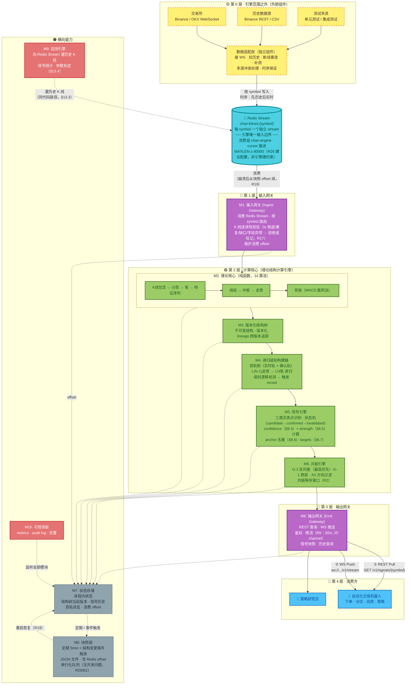
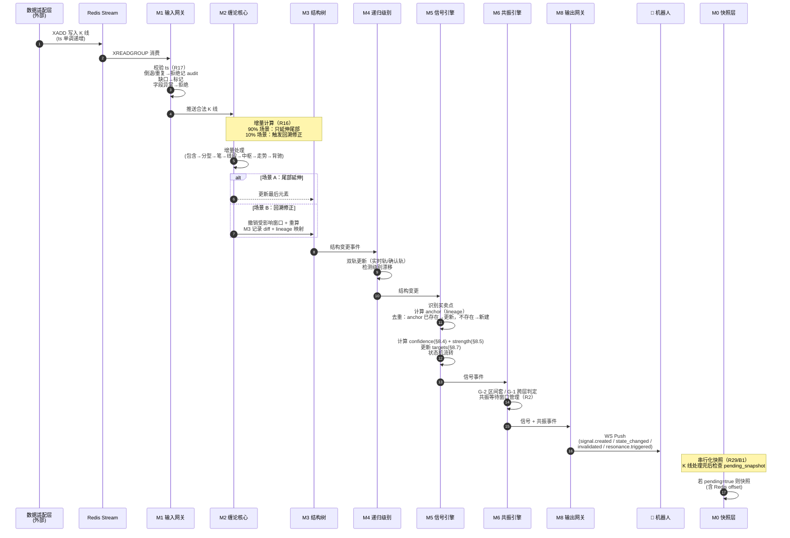
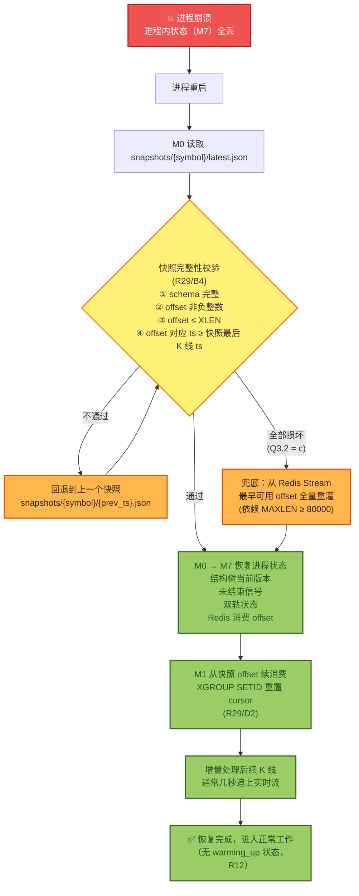
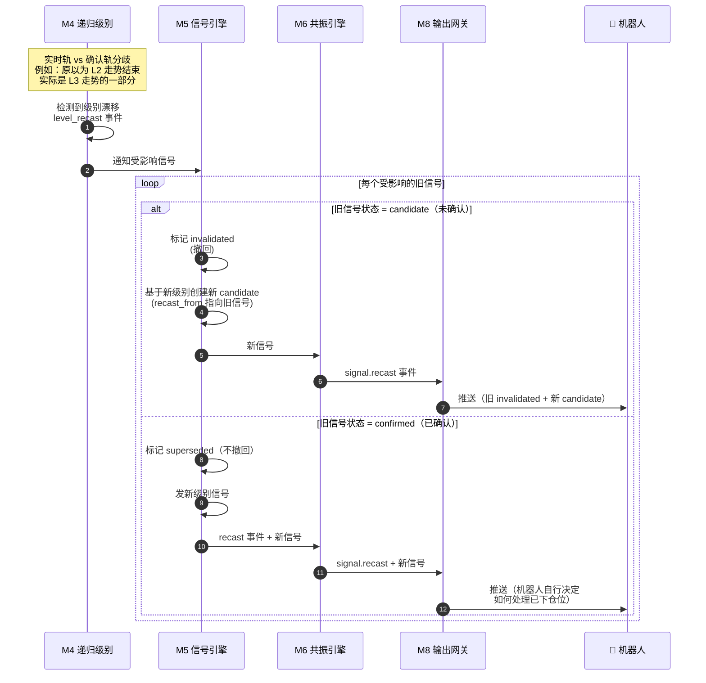
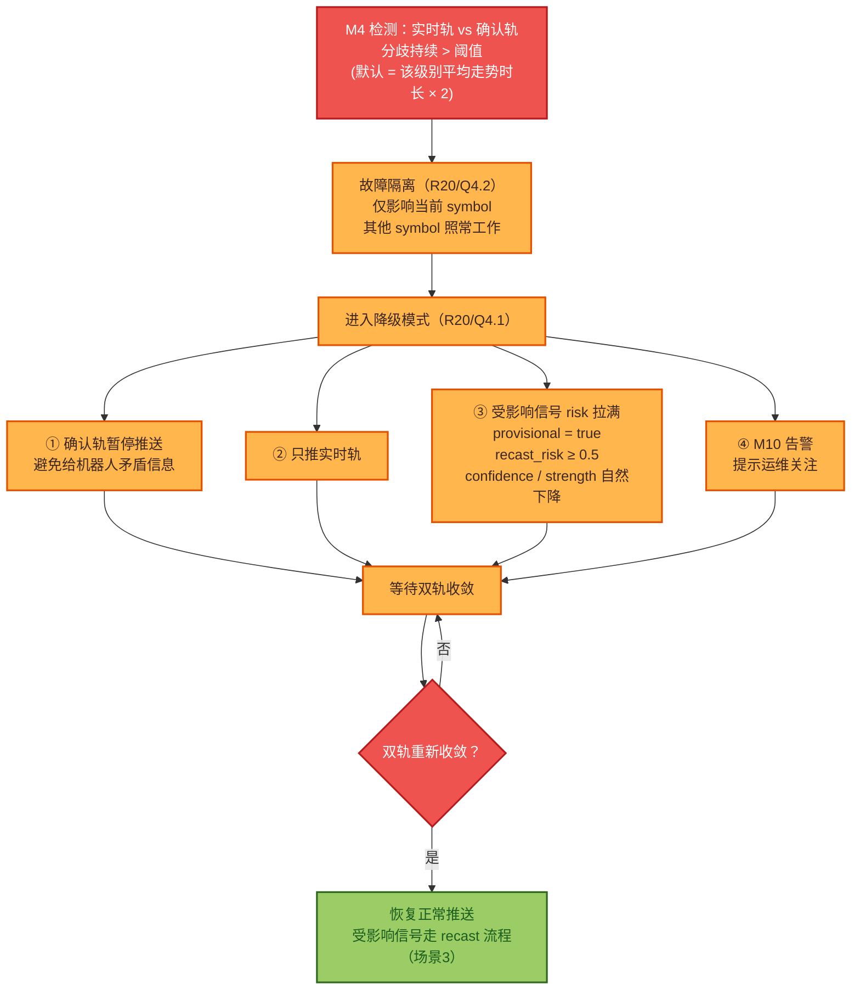
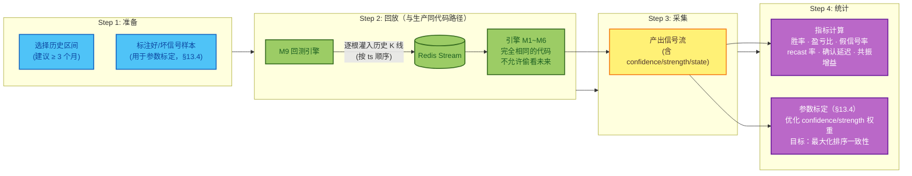

# 信号分析系统 — 架构全景图与交互流程图

> 基于 [PRD-信号分析系统.md](./PRD-信号分析系统.md) v1.8 绘制。
> 所有决策编号（R1~R31）请对照 PRD §19。

---

## 一、全景架构图（分层视角）

> PRD §4 已有一张总图。本图换一个视角——**按层次组织**，突出"输入边界 → 计算核心 → 输出边界"的数据流方向，以及横向能力（回测/可观测/快照）如何切入主链路。

### 全景图读图要点

1. **唯一的输入边界**是 Redis Stream；**唯一的真值**是 stream 里的 K 线。引擎不认识交易所。
2. **主链路**（蓝色→绿色→蓝色）：`M1 输入 → M2 计算 → M3/M4/M5/M6 结构与信号 → M8 输出`。
3. **横向能力**（橙色）贯穿所有层：M7（状态）被所有模块读写；M0（快照）由 M7 派生；M9（回测）通过向 Redis 灌历史 K 线切入；M10（可观测）监听全部。
4. **回测与生产同代码路径**：回测只是把"实盘数据适配层"换成"历史回放"，引擎内部完全无感知。

---

## 二、交互流程图（按场景）

### 场景 1：实时信号产出（最常见，主路径）

> 一根新 K 线从到达到机器人收到信号的完整链路。**这是引擎 99% 时间在做的事。**

**关键点**：
- 步骤 4-5：M1 的校验是引擎的"门神"，垃圾 K 线进不来（R17）
- 步骤 7-9：M2 的增量计算 + M3 的回溯修正是性能与正确性的核心（R16）
- 步骤 14-15：M5 的 anchor 去重保证同一信号不被重复 created（R13）
- 步骤 21：WS 推送是异步的，REST 也可随时查询最新快照

---

### 场景 2：崩溃恢复（R19）

> 引擎进程意外挂掉后的完整恢复链路。

**恢复策略三档**（优先级从高到低）：
1. **快照优先**（正常情况，秒级恢复）
2. **回退上一快照**（最新快照损坏，损失几分钟状态）
3. **全量重灌**（所有快照都坏，最慢但最稳，依赖 Redis MAXLEN）

---

### 场景 3：级别漂移与信号 recast（R20 / §10.3）

> 真递归级别下，"L2 走势被重分类为 L3 的一部分"时，引擎如何处理已发出的信号。

**关键设计**：
- candidate 撤回（没下仓位，干净重发）
- confirmed 不撤回（已下仓位，机器人自己决定）—— **符合"引擎报告，机器人决策"哲学**

---

### 场景 4：双轨分歧降级（R20 / §14.5.4）

> 极端行情下，实时轨与确认轨长期不一致时的降级处理。

**机器人可见性**：故障期间机器人通过 `provisional=true` + 高 `recast_risk` 自然感知风险，不需要特殊协议。

---

### 场景 5：回测流程（§13）

> 回测如何复用生产代码路径验证信号。

**核心原则**：回测与生产**完全同代码路径**——M9 只是把"实盘数据适配层"换成"历史回放"，引擎内部无感知。这保证了回测结果的可信度。

---

## 三、模块职责速查表（配合全景图阅读）

| 模块 | 层 | 职责一句话 | 关键约束 |
|---|---|---|---|
| **数据适配层** | 外部 | 接交易所，产出干净 K 线写 Redis | 不在引擎范围 |
| **M1 输入网关** | L1 | 消费 Redis，校验 K 线，路由到 symbol | 唯一入口；R17 严格校验 |
| **M2 缠论核心** | L2 | 14 份算法的纯函数实现 | 纯函数 + 增量 + 回溯修正（R16）|
| **M3 结构树** | L2 | 不可变版本化结构存储 | lineage 跨版本追踪（§10.5）|
| **M4 递归级别** | L2 | 双轨制多级别构建 | 级别漂移检测 → recast |
| **M5 信号引擎** | L2 | 买卖点识别 + 状态机 + confidence/strength | anchor 去重（R13）|
| **M6 共振引擎** | L2 | G-2 区间套 + G-1 跨层 + A3 过滤 | G-2 最高优先 |
| **M7 状态存储** | 横向 | 进程内状态 | 被所有模块读写 |
| **M0 快照层** | 横向 | JSON 持久化 + 恢复 | 含 Redis offset；串行化（R29/B1）|
| **M8 输出网关** | L3 | REST + WS 对外 | 唯一出口；R6 限流 |
| **M9 回测引擎** | 横向 | 灌历史 K 线 + 统计 | 同代码路径（§13.3）|
| **M10 可观测** | 横向 | metrics + audit + 告警 | 监听全部模块 |

---

*文档版本：v1.1 — 2026-06-22 — 基于 PRD v1.8 绘制（MAXLEN 措辞修正 + 特征序列步骤补充 + 版本号/决策编号同步）*
